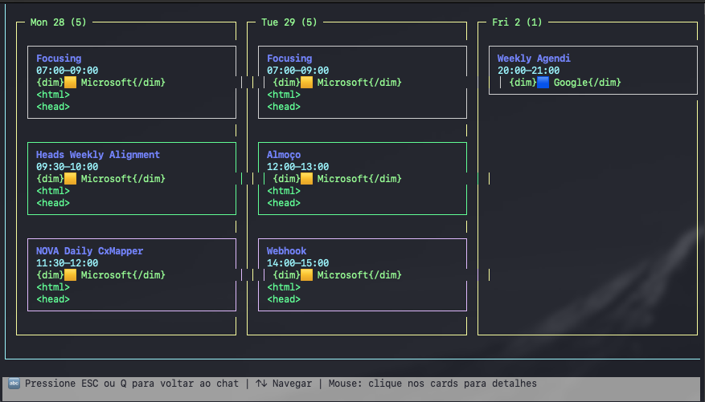
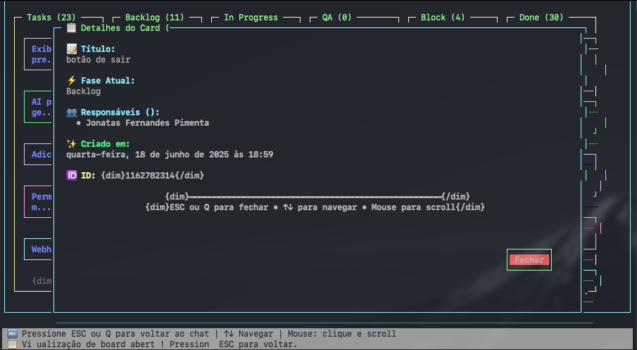
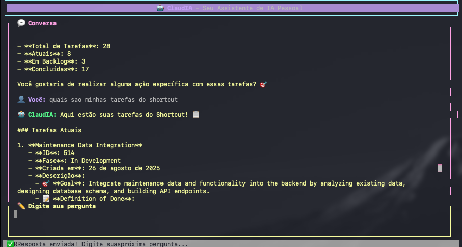
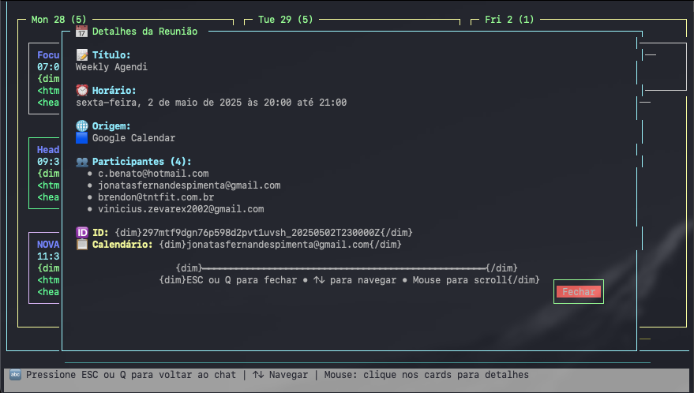

# 🤖 ClaudIA - Intelligent CLI Productivity Assistant

<p align="center">
  
  
  
  
  
  
</p>

## 📋 Overview

ClaudIA is an intelligent productivity assistant running via command-line interface (CLI) that combines the power of Artificial Intelligence with an interactive and elegant terminal interface. Built with Node.js, TypeScript and powered by LangChain/LangGraph, ClaudIA offers a natural conversational experience to manage your productivity through reminders, project checkpoints, intelligent knowledge base, and calendar integration.


*ClaudIA main interface with conversational chat*

## ✨ Features

### 🤖 AI Agent
- **Natural Language Processing**: Communicate with the agent using natural language
- **Conversational Interface**: Intuitive interaction through terminal chat
- **Context-Aware**: The agent maintains conversation context and learns your patterns
- **Intelligent Responses**: Powered by OpenAI GPT-4o-mini for accurate responses

### 📝 Checkpoint Management
- **Milestone Creation**: Create checkpoints for important project milestones
- **Smart Search**: Find checkpoints by project, date, or ID
- **Complete History**: View all your project progress
- **Project Organization**: Group checkpoints by project name


*Board view with project organization*

### ⏰ Reminder System
- **Custom Reminders**: Create reminders with personalized messages
- **Status Management**: Control status (PENDING, IN_PROGRESS, COMPLETED, CANCELLED)
- **Search and Filter**: Find reminders by status, date, or specific ID
- **Real-time Updates**: Update status and track progress

### 🧠 Intelligent Knowledge Base
- **Knowledge Storage**: Save important information that ClaudIA can reference later
- **Semantic Search**: Find relevant knowledge using vector search with Qdrant
- **Automatic Structuring**: ClaudIA automatically organizes text while keeping all content
- **Categorization**: Organize knowledge by custom categories
- **Automatic Context**: ClaudIA automatically searches for relevant knowledge for your questions

### 📅 Calendar Integration (Planned)
- **Google Calendar Support**: Integration with Google Calendar
- **Microsoft Calendar Support**: Integration with Microsoft/Outlook calendars
- **Event Search**: Retrieve events for days, weeks, or custom periods
- **Time Analysis**: Calculate time usage and identify free slots


*Integrated calendar interface for event management*

### 🖥️ Elegant Terminal Interface
- **Blessed UI**: Rich and interactive terminal interface
- **Responsive Design**: Adapts to different terminal sizes
- **Keyboard Navigation**: Complete keyboard shortcuts
- **Cross-platform**: Works on macOS, Linux, and Windows

<div align="center">
  
  
</div>
<div align="center">
  <em>Different views: Organized cards and detailed task list</em>
</div>

## 🚀 Installation

### Prerequisites
- Node.js (v16 or higher)
- npm or yarn
- OpenAI API Key (required)
- Qdrant (for Knowledge Base - required)
- Google Calendar API credentials (optional)
- Microsoft Graph API credentials (optional)

### Quick Installation

```bash
# Clone the repository
git clone https://github.com/your-username/claudia.git
cd ClaudIA

# Install dependencies
npm install

# Configure environment variables
cp .env.example .env

# Edit the .env file and add your OpenAI key (REQUIRED)
# OPENAI_API_KEY=your_openai_key_here
# QDRANT_URL=http://localhost:6333
# 
# Optionally, add calendar credentials:
# GOOGLE_CLIENT_ID=your_google_client_id
# GOOGLE_CLIENT_SECRET=your_google_client_secret
# MICROSOFT_CLIENT_ID=your_microsoft_client_id
# MICROSOFT_CLIENT_SECRET=your_microsoft_client_secret

# Set up the database
npm run db:generate
npm run db:push

# Build the project
npm run build

# Run ClaudIA
npm start
```

### Global Installation (Recommended)

To use the `claudia` command from anywhere in the terminal:

```bash
# Navigate to the project directory
cd ClaudIA

# Install globally using npm link
npm link

# Now you can run from anywhere:
claudia
```

**Or via npm (when published):**

```bash
# Install globally via npm
npm install -g claudia-ai

# Run from anywhere
claudia
```

## 📚 How to Use

### Basic Command

```bash
# Start ClaudIA (conversational interface)
claudia
```

### Interactions with the AI Agent

After running the `claudia` command, you'll enter interactive mode where you can chat naturally with the assistant:

**Conversation Examples:**

```
👤 You: "Create a checkpoint for the website project, completed homepage design"
🤖 ClaudIA: ✓ Checkpoint created successfully!
   - Project: website
   - Summary: Completed homepage design
   - ID: abc123...
   - Created at: 08/26/2024 at 01:15

👤 You: "Show all my checkpoints for the website project"
🤖 ClaudIA: 📋 Here are the checkpoints for 'website' project:
   1. Completed homepage design (08/26/2024)
   2. Authentication system implementation (08/25/2024)
   ...

👤 You: "Create a reminder to review the backend code"
🤖 ClaudIA: ✓ Reminder created!
   - Message: Review backend code
   - Status: PENDING
   - ID: def456...

👤 You: "What are my pending reminders?"
🤖 ClaudIA: 📋 Your pending reminders:
   1. Review backend code (PENDING)
   2. Call the client (PENDING)
   ...

👤 You: "Mark the first reminder as in progress"
🤖 ClaudIA: ✓ Status updated!
   - Reminder: Review backend code
   - Status changed to: IN_PROGRESS

👤 You: "Add this knowledge: TypeScript allows static typing in JavaScript"
🤖 ClaudIA: ✓ Knowledge added successfully!
   📝 Text structured and stored
   🏷️ Category: programming
   🆔 ID: xyz789...
   This knowledge is now available for future queries!

👤 You: "What do you know about TypeScript?"
🤖 ClaudIA: 🔍 Found 1 relevant knowledge:
   📚 TypeScript allows static typing in JavaScript
   🏷️ Category: programming
   ...
```


*Example of detailed event and related task view*

### Available Features via Conversation

**Checkpoint Management:**
- "Create a checkpoint for [project] with [description]"
- "Show all checkpoints"
- "Show checkpoints for project [name]"
- "Show checkpoints since [date]"
- "Find checkpoint with ID [id]"

**Reminder Management:**
- "Create a reminder for [task]"
- "Show my pending reminders"
- "Show all reminders"
- "Mark reminder [id] as completed"
- "Show reminders since [date]"

**Search and Analysis:**
- "Summary of my productivity"
- "Show project progress"
- "What did I do this week?"

**Knowledge Base:**
- "Add this knowledge: [text with important information]"
- "Teach me about [subject]: [detailed explanation]"
- "Search my knowledge about [topic]"
- "What do you know about [subject]?"
- "Add to category [name]: [content]"

### Interface Navigation

- **Enter**: Send question/command
- **Ctrl+C**: Exit application
- **Scroll**: Navigate through conversation history

## 🔧️ Configuration

### Environment Variables

Create a `.env` file in the project root based on `.env.example`:

```env
# AI Configuration (REQUIRED)
OPENAI_API_KEY=your_openai_key_here

# Knowledge Base (REQUIRED)
QDRANT_URL=http://localhost:6333

# Google Calendar (OPTIONAL)
GOOGLE_CLIENT_ID=your_google_client_id
GOOGLE_CLIENT_SECRET=your_google_client_secret
GOOGLE_REDIRECT_URI=your_google_redirect_uri
GOOGLE_REFRESH_TOKEN=your_google_refresh_token

# Microsoft Graph (OPTIONAL)
MICROSOFT_CLIENT_ID=your_microsoft_client_id
MICROSOFT_CLIENT_SECRET=your_microsoft_client_secret
MS_GRAPH_TOKEN=your_ms_graph_token
MS_GRAPH_USER_EMAIL=ms_user_email

# Database (generated automatically)
DATABASE_URL="file:./prisma/dev.db"
```

**Note:** Only `OPENAI_API_KEY` and `QDRANT_URL` are required for basic functionality. Calendar credentials are optional and will be implemented in future versions.

### OpenAI API Configuration

1. Access [OpenAI Platform](https://platform.openai.com/)
2. Create an account or log in
3. Navigate to "API Keys"
4. Create a new API key
5. Add the key to your `.env` file:
   ```env
   OPENAI_API_KEY=sk-proj-...
   ```

### 🧠 Knowledge Base Configuration (Qdrant)

ClaudIA's Knowledge Base uses Qdrant, a high-performance vector database, to store and search knowledge semantically.

#### Install Qdrant

**Option 1: Docker (Recommended)**

```bash
# Download and run Qdrant with Docker
docker run -p 6333:6333 -p 6334:6334 \
    -v $(pwd)/qdrant_storage:/qdrant/storage:z \
    qdrant/qdrant
```

**Option 2: Docker Compose**

Create a `docker-compose.yml` file:

```yaml
version: '3.8'
services:
  qdrant:
    image: qdrant/qdrant:latest
    ports:
      - "6333:6333"
      - "6334:6334"
    volumes:
      - ./qdrant_storage:/qdrant/storage
```

Run:
```bash
docker-compose up -d
```

**Option 3: Local Installation**

Visit the [official Qdrant documentation](https://qdrant.tech/documentation/quick-start/) to install locally.

#### Configure in ClaudIA

After installing Qdrant, add the URL to your `.env` file:

```env
# Qdrant (required for Knowledge Base)
QDRANT_URL=http://localhost:6333
```

**Note:** ClaudIA will automatically create the necessary collection in Qdrant on first run.

#### Verify Installation

You can verify if Qdrant is working by accessing:
- **Web Dashboard**: http://localhost:6333/dashboard
- **API Health**: http://localhost:6333/health

---

### 🔧 Calendar Configuration

To connect your Google and Microsoft calendars to ClaudIA, you need to create applications on the respective platforms and run authentication commands.

#### 📅 Google Calendar

##### Step 1: Create Application in Google Cloud Console

1. **Access Google Cloud Console**
   - Go to: https://console.cloud.google.com/
   - Log in with your Google account

2. **Create or Select Project**
   - Click on the project selector at the top of the page
   - Click "New Project" or select an existing project
   - Suggested name: `ClaudIA Calendar Integration`

3. **Enable Google Calendar API**
   - In the side menu, go to "APIs & Services" > "Library"
   - Search for "Google Calendar API"
   - Click on the API and then "Enable"

4. **Configure OAuth Consent Screen**
   - Go to "APIs & Services" > "OAuth consent screen"
   - Choose "External" (or "Internal" if corporate account)
   - Fill in required fields:
     - **App name**: `ClaudIA`
     - **User support email**: your email
     - **Developer contact email**: your email
   - Click "Save and Continue"
   - In "Scopes", click "Add or Remove Scopes"
   - Add the scope: `https://www.googleapis.com/auth/calendar.readonly`
   - Save and continue to the end

5. **Create OAuth 2.0 Credentials**
   - Go to "APIs & Services" > "Credentials"
   - Click "+ Create Credentials" > "OAuth 2.0 Client ID"
   - Application type: **Web application**
   - Name: `ClaudIA Desktop Client`
   - **Authorized redirect URIs**:
     - `http://localhost:3000/auth/callback`
     - `urn:ietf:wg:oauth:2.0:oob` (for simplified mode)

6. **Get Credentials**
   - After creating, copy the **Client ID** and **Client Secret**
   - Add to your `.env` file:
   ```env
   GOOGLE_CLIENT_ID=your_client_id_here
   GOOGLE_CLIENT_SECRET=your_client_secret_here
   GOOGLE_REDIRECT_URI=http://localhost:3000/auth/callback
   ```

##### Step 2: Run Authentication

```bash
# Method 1: With local server (recommended)
npm run auth:google

# Method 2: Simplified mode (manual)
npm run auth:google-simple
```

**Method 1 (Local Server):**
1. Run the command above
2. Open the link that appears in the terminal
3. Log in with your Google account
4. Authorize permissions
5. You will be redirected automatically
6. The refresh token will be saved in `.env`

**Method 2 (Manual):**
1. Run the command above
2. Copy and paste the URL in the browser
3. After authorizing, copy the code that appears
4. Paste the code in the terminal when prompted
5. The refresh token will be saved in `.env`

---

#### 🏢 Microsoft Calendar (Office 365/Outlook)

##### Step 1: Register Application in Azure AD

1. **Access Azure Portal**
   - Go to: https://portal.azure.com/
   - Log in with your Microsoft/corporate account

2. **Navigate to Azure Active Directory**
   - In the side menu, click "Azure Active Directory"
   - Or use the search bar to find it

3. **Create App Registration**
   - In the Azure AD menu, click "App registrations"
   - Click "+ New registration"

4. **Configure Registration**
   - **Name**: `ClaudIA Microsoft Graph Integration`
   - **Supported account types**:
     - For personal accounts: "Accounts in any organizational directory and personal Microsoft accounts"
     - For corporate accounts: "Accounts in this organizational directory only"
   - **Redirect URI**:
     - Type: **Web**
     - URI: `http://localhost:3000/auth/microsoft/callback`
   - Click "Register"

5. **Get Basic Credentials**
   - On the application overview page, copy:
     - **Application (client) ID** → your `MICROSOFT_CLIENT_ID`
     - **Directory (tenant) ID** → your `MICROSOFT_TENANT_ID` (optional)

6. **Create Client Secret**
   - Go to "Certificates & secrets"
   - Click "+ New client secret"
   - Description: `ClaudIA Auth Secret`
   - Expiration: 24 months (recommended)
   - Click "Add"
   - **⚠️ IMPORTANT**: Copy the **Value** immediately! It won't be shown again

7. **Configure API Permissions**
   - Go to "API permissions"
   - Click "+ Add a permission"
   - Select "Microsoft Graph"
   - Choose "Delegated permissions"
   - Add the following permissions:
     - `Calendars.ReadWrite` - Read and write calendars
     - `User.Read` - Read basic profile
     - `Mail.Read` - Read emails (optional)
     - `offline_access` - Offline access (refresh tokens)
   - Click "Add permissions"
   - **IMPORTANT**: Click "Grant admin consent for [your organization]" if available

8. **Add Credentials to .env**
   ```env
   # Microsoft Graph (required)
   MICROSOFT_CLIENT_ID=your_client_id_here
   MICROSOFT_CLIENT_SECRET=your_client_secret_here
   MICROSOFT_TENANT_ID=common
   
   # Optional: specific user email
   MS_GRAPH_USER_EMAIL=your_email@example.com
   ```

##### Step 2: Run Authentication

```bash
# Run Microsoft authentication
npm run auth:microsoft

# Check token status
npm run auth:microsoft:status
```

**Authentication Process:**
1. Run `npm run auth:microsoft`
2. The command will automatically open the browser
3. Log in with your Microsoft account
4. Authorize the requested permissions
5. You will be redirected to a success page
6. Tokens will be automatically saved in `.env`

**Check Status:**
```bash
npm run auth:microsoft:status
```

Example output:
```
📋 Configuration:
   Client ID: ✅ Configured
   Client Secret: ✅ Configured
   Tenant ID: common

🎫 Tokens:
   Access Token: ✅ Available
   Refresh Token: ✅ Available
   Expires at: 08/27/2025, 12:39:05
   ⏳ Time remaining: 58 minute(s)

✅ Basic configuration OK
✅ Automatic renewal available
```

---

#### 🔄 Automatic Token Renewal

ClaudIA has an intelligent automatic renewal system:

- **Google**: Refresh tokens are valid indefinitely (until revoked)
- **Microsoft**: Tokens are automatically renewed 5 minutes before expiring
- **Fallback**: If renewal fails, uses current token temporarily
- **Logs**: System provides detailed logs about renewals

#### 🛠️ Authentication Commands

```bash
# Google Calendar
npm run auth:google           # Authentication with local server
npm run auth:google-simple    # Manual authentication

# Microsoft Calendar
npm run auth:microsoft         # Microsoft authentication
npm run auth:microsoft:status  # Check token status
```

#### ⚠️ Troubleshooting

**Google Calendar:**
- **Error "redirect_uri_mismatch"**: Check if redirect URI is correct in Google Cloud Console
- **Error "access_denied"**: Check if Google Calendar API is enabled
- **Expired token**: Re-run authentication command

**Microsoft Calendar:**
- **Error "invalid_client"**: Check if CLIENT_ID and CLIENT_SECRET are correct
- **Error "insufficient_scope"**: Check if all permissions were granted in Azure AD
- **Expired token**: Run `npm run auth:microsoft:status` to check and `npm run auth:microsoft` to renew

**General:**
- **"Missing environment variables"**: Check if all variables are in `.env` file
- **Network problem**: Check if localhost:3000 is not being used by another application

## 🏢️ Architecture

### Real Project Structure

```
ClaudIA/
├── bin/
│   └── claudia           # Global executable script
├── src/
│   ├── agent/            # AI Agent with LangChain/LangGraph
│   │   ├── agent.ts       # Main agent implementation
│   │   ├── prompts.ts     # System prompts and configurations
│   │   ├── tool-inventory.ts # Tool inventory
│   │   └── tools/         # Agent tools
│   │       ├── checkpoint-tools.ts
│   │       ├── reminder-tools.ts
│   │       ├── knowledge-tools.ts
│   │       └── calendar-tools.ts
│   ├── modules/
│   │   └── knowledge/     # Knowledge base module
│   │       ├── application/
│   │       ├── domain/
│   │       └── infrastructure/
│   ├── types/            # TypeScript definitions
│   └── index.ts          # User interface (Blessed UI)
├── prisma/
│   ├── schema.prisma     # Database schema
│   └── dev.db            # SQLite database
├── package.json          # Configurations and dependencies
├── tsconfig.json        # TypeScript configuration
└── .env                 # Environment variables
```

### Main Technologies

- **Node.js + TypeScript**: Application foundation
- **LangChain/LangGraph**: Framework for AI agents
- **OpenAI GPT-4o-mini**: Language model
- **Qdrant**: Vector database for knowledge base
- **Blessed**: Rich terminal interface
- **Prisma ORM**: Object-relational mapping
- **SQLite**: Local database
- **Zod**: TypeScript schema validation

### Architecture Pattern

**Clean Architecture** with domain separation:
- **Agent Layer**: AI agent logic and tools
- **UI Layer**: User interface with Blessed
- **Data Layer**: Persistence with Prisma + SQLite
- **Domain Logic**: Use cases and business entities

## 🧪 Development

### Setup Development Environment

```bash
# Install development dependencies
npm install

# Run in development mode with hot reload
npm run dev

# Run tests
npm test

# Run tests with coverage
npm run test:coverage

# Lint code
npm run lint

# Format code
npm run format
```

### Testing

```bash
# Run all tests
npm test

# Run specific test suite
npm test -- --grep "calendar"

# Run tests in watch mode
npm run test:watch
```

### Building

```bash
# Build for production
npm run build

# Build and package for distribution
npm run package
```

## 📚 API Reference

### Conversational Commands

| Feature | Description | Natural Command Example |
|---------|-------------|-------------------------|
| Reminders | Create and manage reminders | "Create a reminder to call my mom tomorrow" |
| Checkpoints | Record project milestones | "Create a checkpoint for website project, completed design" |
| Knowledge Base | Store and search information | "Add this knowledge: [text]", "What do you know about [topic]?" |
| Calendar | View calendar events | "Show my schedule today", "What do I have next week?" |
| Help | Show available commands | "What can you do?", "Help me with commands" |

### Configuration Options

| Option | Type | Description | Default |
|--------|------|-------------|---------|
| `calendar.provider` | string | Calendar provider (`google` or `microsoft`) | `google` |
| `ui.theme` | string | Terminal UI theme | `default` |
| `agent.model` | string | AI model to use | `gpt-3.5-turbo` |
| `storage.path` | string | Local database path | `./claudia.db` |

## 🤝 Contributing

We welcome contributions! Please see our [Contributing Guide](CONTRIBUTING.md) for details.

### Development Workflow

1. Fork the repository
2. Create a feature branch: `git checkout -b feature/amazing-feature`
3. Commit your changes: `git commit -m 'Add amazing feature'`
4. Push to the branch: `git push origin feature/amazing-feature`
5. Open a Pull Request

### Code Style

- Follow the existing code style
- Use TypeScript for all new code
- Add tests for new features
- Update documentation as needed

## 📄 License

This project is licensed under the MIT License - see the [LICENSE](LICENSE) file for details.

## 🆘 Support

- 📖 [Documentation](https://github.com/your-username/claudia/wiki)
- 🐛 [Issues](https://github.com/your-username/claudia/issues)
- 💬 [Discussions](https://github.com/your-username/claudia/discussions)
- 📧 Email: support@claudia.dev

## 🗺️ Roadmap
- [ ] Advanced AI scheduling optimization
- [ ] Plugin system for extensibility
- [ ] Slack/Teams integration
- [ ] Multi-language support
- [ ] Mobile companion app

## 🙏 Acknowledgments

- LangChain team for the excellent AI framework
- Blessed library maintainers for the terminal UI capabilities
- Google and Microsoft for their calendar APIs
- OpenAI for the language model capabilities
- Qdrant team for the vector database

---

<p align="center">
  Made with ❤️ by the ClaudIA team
</p>

<p align="center">
  <a href="README.md">🇧🇷 Português</a> • <a href="README.en.md">🇺🇸 English</a>
</p>
