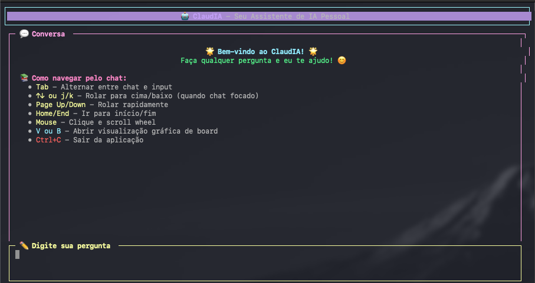
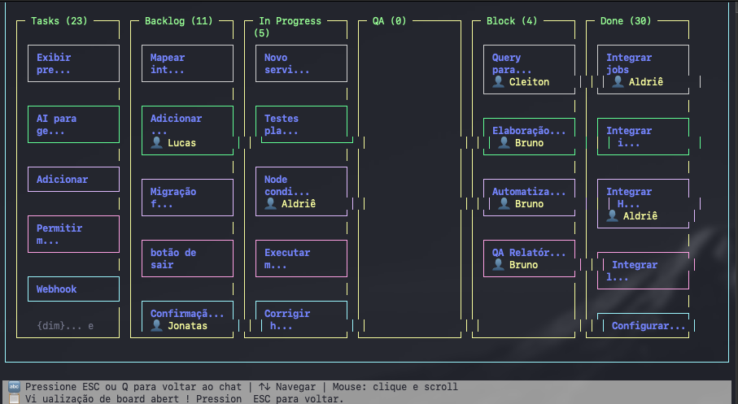
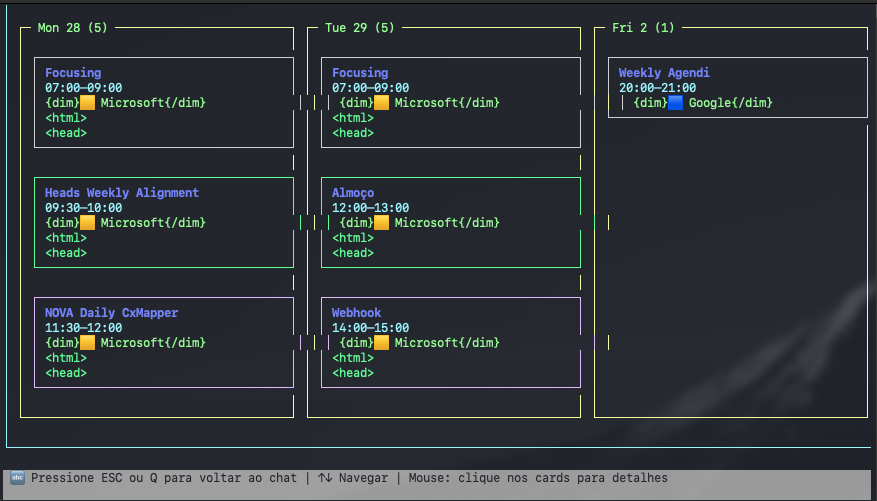
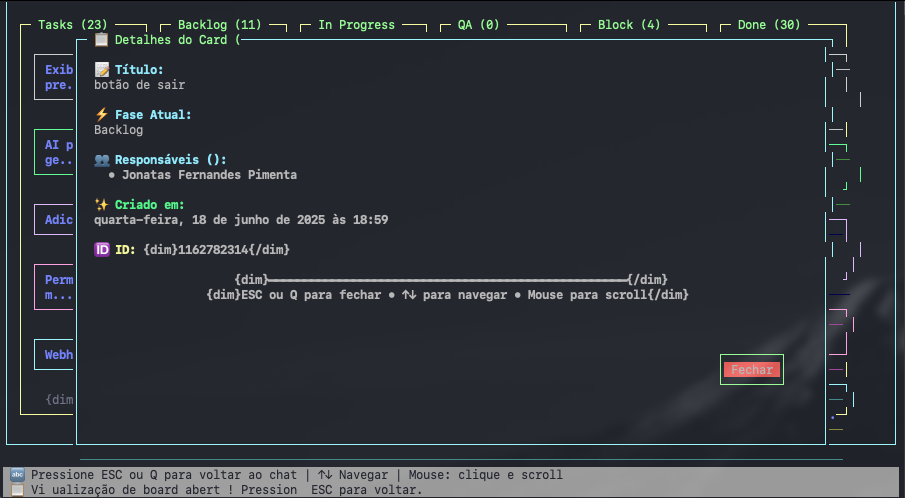
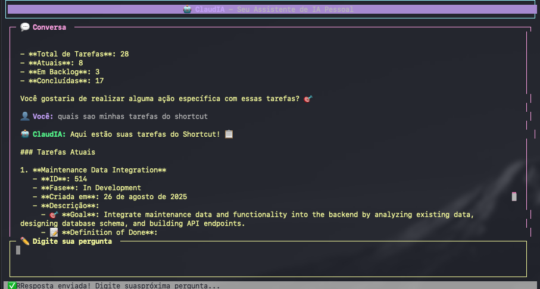
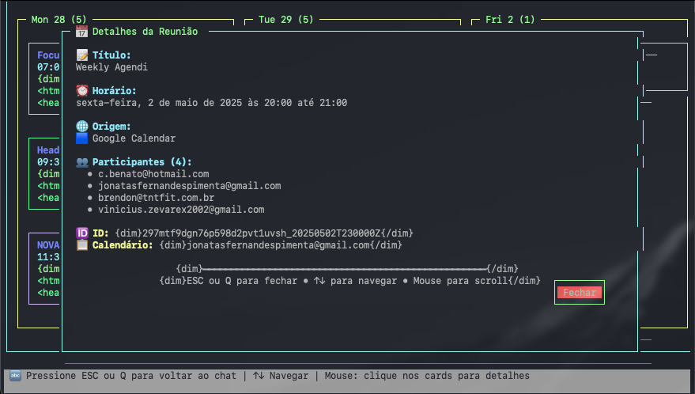

# 🤖 ClaudIA - Assistente Inteligente de Produtividade CLI

<p align="center">
  
  
  
  
  
  
</p>

## 📋 Visão Geral

ClaudIA é um assistente inteligente de produtividade executado via linha de comando (CLI) que combina o poder da Inteligência Artificial com uma interface terminal interativa e elegante. Construído com Node.js, TypeScript e potencializado pelo LangChain/LangGraph, o ClaudIA oferece uma experiência conversacional natural para gerenciar sua produtividade através de lembretes, checkpoints de projetos, base de conhecimento inteligente e integração com calendários.


*Interface principal do ClaudIA com chat conversacional*

## ✨ Funcionalidades

### 🤖 Agente com IA
- **Processamento de Linguagem Natural**: Comunique-se com o agente usando linguagem natural
- **Interface Conversacional**: Interação intuitiva através de chat no terminal
- **Context-Aware**: O agente mantém contexto das conversas e aprende seus padrões
- **Respostas Inteligentes**: Powered by OpenAI GPT-4o-mini para respostas precisas

### 📝 Gerenciamento de Checkpoints
- **Criação de Marcos**: Crie checkpoints para marcos importantes dos seus projetos
- **Busca Inteligente**: Encontre checkpoints por projeto, data ou ID
- **Histórico Completo**: Visualize todo o progresso dos seus projetos
- **Organização por Projeto**: Agrupe checkpoints por nome do projeto


*Visualização de quadro com organização dos projetos*

### ⏰ Sistema de Lembretes
- **Lembretes Personalizados**: Crie lembretes com mensagens personalizadas
- **Gerenciamento de Status**: Controle o status (PENDING, IN_PROGRESS, COMPLETED, CANCELLED)
- **Busca e Filtragem**: Encontre lembretes por status, data ou ID específico
- **Atualizações em Tempo Real**: Atualize status e acompanhe progresso

### 🧠 Base de Conhecimento Inteligente
- **Armazenamento de Conhecimento**: Salve informações importantes que ClaudIA pode consultar depois
- **Busca Semântica**: Encontre conhecimentos relevantes usando busca vetorial com Qdrant
- **Estruturação Automática**: ClaudIA organiza automaticamente o texto mantendo todo o conteúdo
- **Categorização**: Organize conhecimentos por categorias personalizadas
- **Contexto Automático**: ClaudIA busca automaticamente conhecimentos relevantes para suas perguntas

### 📅 Integração com Calendários (Planejado)
- **Suporte ao Google Calendar**: Integração com Google Calendar
- **Suporte ao Microsoft Calendar**: Integração com calendários Microsoft/Outlook
- **Busca de Eventos**: Recupere eventos para dias, semanas ou períodos personalizados
- **Análise de Tempo**: Calcule uso do tempo e identifique slots livres


*Interface de calendário integrada para gerenciamento de eventos*

### 🖥️ Interface Terminal Elegante
- **Blessed UI**: Interface rica e interativa no terminal
- **Design Responsivo**: Adapta-se a diferentes tamanhos de terminal
- **Navegação por Teclado**: Atalhos de teclado completos
- **Multiplataforma**: Funciona em macOS, Linux e Windows

<div align="center">
  
  
</div>
<div align="center">
  <em>Diferentes visualizações: Cards organizados e lista detalhada de tarefas</em>
</div>

## 🚀 Instalação

### Pré-requisitos
- Node.js (v16 ou superior)
- npm ou yarn
- Chave da API OpenAI (obrigatório)
- Qdrant (para Base de Conhecimento - obrigatório)
- Credenciais Google Calendar API (opcional)
- Credenciais Microsoft Graph API (opcional)

### Instalação Rápida

```bash
# Clone o repositório
git clone https://github.com/your-username/claudia.git
cd ClaudIA

# Instale as dependências
npm install

# Configure as variáveis de ambiente
cp .env.example .env

# Edite o arquivo .env e adicione sua chave da OpenAI (OBRIGATÓRIO)
# OPENAI_API_KEY=sua_chave_openai_aqui
# 
# Opcionalmente, adicione credenciais de calendário:
# GOOGLE_CLIENT_ID=seu_google_client_id
# GOOGLE_CLIENT_SECRET=seu_google_client_secret
# MICROSOFT_CLIENT_ID=seu_microsoft_client_id
# MICROSOFT_CLIENT_SECRET=seu_microsoft_client_secret

# Configure o banco de dados
npm run db:generate
npm run db:push

# Compile o projeto
npm run build

# Execute o ClaudIA
npm start
```

### Instalação Global (Recomendado)

Para usar o comando `claudia` de qualquer lugar do terminal:

```bash
# Navegue até o diretório do projeto
cd ClaudIA

# Instale globalmente usando npm link
npm link

# Agora você pode executar de qualquer lugar:
claudia
```

**Ou via npm (quando publicado):**

```bash
# Instalar globalmente via npm
npm install -g claudia-ai

# Executar de qualquer lugar
claudia
```

## 📚 Como Usar

### Comando Básico

```bash
# Inicie o ClaudIA (interface conversacional)
claudia
```

### Interações com o Agente IA

Após executar o comando `claudia`, você entrará no modo interativo onde pode conversar naturalmente com o assistente:

**Exemplos de Conversação:**

```
👤 Você: "Crie um checkpoint para o projeto website, concluí o design da homepage"
🤖 ClaudIA: ✓ Checkpoint criado com sucesso!
   - Projeto: website
   - Resumo: Concluí o design da homepage
   - ID: abc123...
   - Criado em: 26/08/2024 às 01:15

👤 Você: "Mostre todos os meus checkpoints do projeto website"
🤖 ClaudIA: 📋 Aqui estão os checkpoints do projeto 'website':
   1. Concluí o design da homepage (26/08/2024)
   2. Implementação do sistema de autenticação (25/08/2024)
   ...

👤 Você: "Crie um lembrete para revisar o código do backend"
🤖 ClaudIA: ✓ Lembrete criado!
   - Mensagem: Revisar o código do backend
   - Status: PENDING
   - ID: def456...

👤 Você: "Quais são meus lembretes pendentes?"
🤖 ClaudIA: 📋 Seus lembretes pendentes:
   1. Revisar o código do backend (PENDING)
   2. Ligar para o cliente (PENDING)
   ...

👤 Você: "Marque o primeiro lembrete como em progresso"
🤖 ClaudIA: ✓ Status atualizado!
   - Lembrete: Revisar o código do backend
   - Status alterado para: IN_PROGRESS

👤 Você: "Adicione este conhecimento: TypeScript permite tipagem estática em JavaScript"
🤖 ClaudIA: ✓ Conhecimento adicionado com sucesso!
   📝 Texto estruturado e armazenado
   🏷️ Categoria: programação
   🆔 ID: xyz789...
   Este conhecimento agora está disponível para consultas futuras!

👤 Você: "O que você sabe sobre TypeScript?"
🤖 ClaudIA: 🔍 Encontrei 1 conhecimento relevante:
   📚 TypeScript permite tipagem estática em JavaScript
   🏷️ Categoria: programação
   ...
```


*Exemplo de visualização detalhada de eventos e tarefas relacionadas*

### Funcionalidades Disponíveis via Conversa

**Gerenciamento de Checkpoints:**
- “Crie um checkpoint para [projeto] com [descrição]”
- “Mostre todos os checkpoints”
- “Mostre checkpoints do projeto [nome]”
- “Mostre checkpoints desde [data]”
- “Encontre checkpoint com ID [id]”

**Gerenciamento de Lembretes:**
- “Crie um lembrete para [tarefa]”
- “Mostre meus lembretes pendentes”
- “Mostre todos os lembretes”
- “Marque lembrete [id] como concluído”
- “Mostre lembretes desde [data]”

**Busca e Análise:**
- "Resumo da minha produtividade"
- "Mostrar progresso dos projetos"
- "O que eu fiz esta semana?"

**Base de Conhecimento:**
- "Adicione este conhecimento: [texto com informações importantes]"
- "Me ensine sobre [assunto]: [explicação detalhada]"
- "Busque no meu conhecimento sobre [tema]"
- "O que você sabe sobre [assunto]?"
- "Adicione na categoria [nome]: [conteúdo]"

### Navegação na Interface

- **Enter**: Enviar pergunta/comando
- **Ctrl+C**: Sair da aplicação
- **Scroll**: Navegar pelo histórico de conversa

## 🔧️ Configuração

### Variáveis de Ambiente

Crie um arquivo `.env` na raiz do projeto baseado no `.env.example`:

```env
# Configuração da IA (OBRIGATÓRIO)
OPENAI_API_KEY=sua_chave_openai_aqui

# Base de Conhecimento (OBRIGATÓRIO)
QDRANT_URL=http://localhost:6333

# Google Calendar (OPCIONAL)
GOOGLE_CLIENT_ID=seu_google_client_id
GOOGLE_CLIENT_SECRET=seu_google_client_secret
GOOGLE_REDIRECT_URI=sua_google_redirect_uri
GOOGLE_REFRESH_TOKEN=seu_google_refresh_token

# Microsoft Graph (OPCIONAL)
MICROSOFT_CLIENT_ID=seu_microsoft_client_id
MICROSOFT_CLIENT_SECRET=seu_microsoft_client_secret
MS_GRAPH_TOKEN=seu_ms_graph_token
MS_GRAPH_USER_EMAIL=email_do_usuario_ms

# Banco de Dados (gerado automaticamente)
DATABASE_URL="file:./prisma/dev.db"
```

**Nota:** Apenas a `OPENAI_API_KEY` é obrigatória para o funcionamento básico. As credenciais de calendário são opcionais e serão implementadas em versões futuras.

### Configuração da OpenAI API

1. Acesse [OpenAI Platform](https://platform.openai.com/)
2. Crie uma conta ou faça login
3. Navegue para "API Keys"
4. Crie uma nova chave de API
5. Adicione a chave ao seu arquivo `.env`:
   ```env
   OPENAI_API_KEY=sk-proj-...
   ```

### 🧠 Configuração da Base de Conhecimento (Qdrant)

A Base de Conhecimento do ClaudIA utiliza o Qdrant, um banco de dados vetorial de alta performance, para armazenar e buscar conhecimentos de forma semântica.

#### Instalar Qdrant

**Opção 1: Docker (Recomendado)**

```bash
# Baixar e executar Qdrant com Docker
docker run -p 6333:6333 -p 6334:6334 \
    -v $(pwd)/qdrant_storage:/qdrant/storage:z \
    qdrant/qdrant
```

**Opção 2: Docker Compose**

Crie um arquivo `docker-compose.yml`:

```yaml
version: '3.8'
services:
  qdrant:
    image: qdrant/qdrant:latest
    ports:
      - "6333:6333"
      - "6334:6334"
    volumes:
      - ./qdrant_storage:/qdrant/storage
```

Execute:
```bash
docker-compose up -d
```

**Opção 3: Instalação Local**

Visite a [documentação oficial do Qdrant](https://qdrant.tech/documentation/quick-start/) para instalar localmente.

#### Configurar no ClaudIA

Após instalar o Qdrant, adicione a URL ao seu arquivo `.env`:

```env
# Qdrant (obrigatório para Base de Conhecimento)
QDRANT_URL=http://localhost:6333
```

**Nota:** O ClaudIA criará automaticamente a coleção necessária no Qdrant na primeira execução.

#### Verificar Instalação

Você pode verificar se o Qdrant está funcionando acessando:
- **Dashboard Web**: http://localhost:6333/dashboard
- **API Health**: http://localhost:6333/health

---

### 🔧 Configuração de Calendários

Para conectar seus calendários Google e Microsoft ao ClaudIA, você precisa criar aplicações nas respectivas plataformas e executar os comandos de autenticação.

#### 📅 Google Calendar

##### Passo 1: Criar Aplicação no Google Cloud Console

1. **Acesse o Google Cloud Console**
   - Vá para: https://console.cloud.google.com/
   - Faça login com sua conta Google

2. **Criar ou Selecionar Projeto**
   - Clique no seletor de projetos no topo da página
   - Clique em "Novo Projeto" ou selecione um projeto existente
   - Nome sugerido: `ClaudIA Calendar Integration`

3. **Ativar a Google Calendar API**
   - No menu lateral, vá para "APIs e Serviços" > "Biblioteca"
   - Pesquise por "Google Calendar API"
   - Clique na API e depois em "Ativar"

4. **Configurar Tela de Consentimento OAuth**
   - Vá para "APIs e Serviços" > "Tela de consentimento OAuth"
   - Escolha "Externo" (ou "Interno" se for conta corporativa)
   - Preencha os campos obrigatórios:
     - **Nome do app**: `ClaudIA`
     - **E-mail de suporte do usuário**: seu email
     - **E-mail de contato do desenvolvedor**: seu email
   - Clique em "Salvar e Continuar"
   - Em "Escopos", clique em "Adicionar ou remover escopos"
   - Adicione o escopo: `https://www.googleapis.com/auth/calendar.readonly`
   - Salve e continue até o fim

5. **Criar Credenciais OAuth 2.0**
   - Vá para "APIs e Serviços" > "Credenciais"
   - Clique em "+ Criar Credenciais" > "ID do cliente OAuth 2.0"
   - Tipo de aplicação: **Aplicação da Web**
   - Nome: `ClaudIA Desktop Client`
   - **URIs de redirecionamento autorizados**:
     - `http://localhost:3000/auth/callback`
     - `urn:ietf:wg:oauth:2.0:oob` (para modo simplificado)

6. **Obter Credenciais**
   - Após criar, copie o **Client ID** e **Client Secret**
   - Adicione ao seu arquivo `.env`:
   ```env
   GOOGLE_CLIENT_ID=seu_client_id_aqui
   GOOGLE_CLIENT_SECRET=seu_client_secret_aqui
   GOOGLE_REDIRECT_URI=http://localhost:3000/auth/callback
   ```

##### Passo 2: Executar Autenticação

```bash
# Método 1: Com servidor local (recomendado)
npm run auth:google

# Método 2: Modo simplificado (manual)
npm run auth:google-simple
```

**Método 1 (Servidor Local):**
1. Execute o comando acima
2. Abra o link que aparecer no terminal
3. Faça login com sua conta Google
4. Autorize as permissões
5. Você será redirecionado automaticamente
6. O refresh token será salvo no `.env`

**Método 2 (Manual):**
1. Execute o comando acima
2. Copie e cole o URL no navegador
3. Após autorizar, copie o código que aparecer
4. Cole o código no terminal quando solicitado
5. O refresh token será salvo no `.env`

---

#### 🏢 Microsoft Calendar (Office 365/Outlook)

##### Passo 1: Registrar Aplicação no Azure AD

1. **Acesse o Azure Portal**
   - Vá para: https://portal.azure.com/
   - Faça login com sua conta Microsoft/corporativa

2. **Navegar até Azure Active Directory**
   - No menu lateral, clique em "Azure Active Directory"
   - Ou use a barra de pesquisa para encontrar

3. **Criar Registro de Aplicativo**
   - No menu do Azure AD, clique em "App registrations" (Registros de aplicativo)
   - Clique em "+ New registration" (+ Novo registro)

4. **Configurar o Registro**
   - **Nome**: `ClaudIA Microsoft Graph Integration`
   - **Tipos de conta com suporte**:
     - Para contas pessoais: "Accounts in any organizational directory and personal Microsoft accounts"
     - Para contas corporativas: "Accounts in this organizational directory only"
   - **URI de Redirecionamento**:
     - Tipo: **Web**
     - URI: `http://localhost:3000/auth/microsoft/callback`
   - Clique em "Registrar"

5. **Obter Credenciais Básicas**
   - Na página de visão geral da aplicação, copie:
     - **Application (client) ID** → seu `MICROSOFT_CLIENT_ID`
     - **Directory (tenant) ID** → seu `MICROSOFT_TENANT_ID` (opcional)

6. **Criar Client Secret**
   - Vá para "Certificates & secrets" (Certificados e segredos)
   - Clique em "+ New client secret" (+ Novo segredo do cliente)
   - Descrição: `ClaudIA Auth Secret`
   - Expiração: 24 meses (recomendado)
   - Clique em "Add"
   - **⚠️ IMPORTANTE**: Copie o **Value** imediatamente! Não será mostrado novamente

7. **Configurar Permissões da API**
   - Vá para "API permissions" (Permissões de API)
   - Clique em "+ Add a permission" (+ Adicionar uma permissão)
   - Selecione "Microsoft Graph"
   - Escolha "Delegated permissions" (Permissões delegadas)
   - Adicione as seguintes permissões:
     - `Calendars.ReadWrite` - Leitura e escrita de calendários
     - `User.Read` - Leitura do perfil básico
     - `Mail.Read` - Leitura de emails (opcional)
     - `offline_access` - Acesso offline (refresh tokens)
   - Clique em "Add permissions"
   - **IMPORTANTE**: Clique em "Grant admin consent for [your organization]" se disponível

8. **Adicionar Credenciais ao .env**
   ```env
   # Microsoft Graph (obrigatório)
   MICROSOFT_CLIENT_ID=seu_client_id_aqui
   MICROSOFT_CLIENT_SECRET=seu_client_secret_aqui
   MICROSOFT_TENANT_ID=common
   
   # Opcional: email específico do usuário
   MS_GRAPH_USER_EMAIL=seu_email@exemplo.com
   ```

##### Passo 2: Executar Autenticação

```bash
# Executar autenticação Microsoft
npm run auth:microsoft

# Verificar status dos tokens
npm run auth:microsoft:status
```

**Processo de Autenticação:**
1. Execute `npm run auth:microsoft`
2. O comando abrirá automaticamente o navegador
3. Faça login com sua conta Microsoft
4. Autorize as permissões solicitadas
5. Você será redirecionado para uma página de sucesso
6. Os tokens serão automaticamente salvos no `.env`

**Verificar Status:**
```bash
npm run auth:microsoft:status
```

Saída de exemplo:
```
📋 Configuração:
   Client ID: ✅ Configurado
   Client Secret: ✅ Configurado
   Tenant ID: common

🎫 Tokens:
   Access Token: ✅ Disponível
   Refresh Token: ✅ Disponível
   Expira em: 27/08/2025, 12:39:05
   ⏳ Tempo restante: 58 minuto(s)

✅ Configuração básica OK
✅ Renovação automática disponível
```

---

#### 🔄 Renovação Automática de Tokens

O ClaudIA possui um sistema inteligente de renovação automática:

- **Google**: Refresh tokens são válidos indefinidamente (até serem revogados)
- **Microsoft**: Tokens são renovados automaticamente 5 minutos antes de expirar
- **Fallback**: Se a renovação falhar, usa o token atual temporariamente
- **Logs**: Sistema fornece logs detalhados sobre renovações

#### 🛠️ Comandos de Autenticação

```bash
# Google Calendar
npm run auth:google           # Autenticação com servidor local
npm run auth:google-simple     # Autenticação manual

# Microsoft Calendar
npm run auth:microsoft         # Autenticação Microsoft
npm run auth:microsoft:status  # Verificar status dos tokens
```

#### ⚠️ Troubleshooting

**Google Calendar:**
- **Erro "redirect_uri_mismatch"**: Verifique se a URI de redirecionamento está correta no Google Cloud Console
- **Erro "access_denied"**: Verifique se a Google Calendar API está ativada
- **Token expirado**: Re-execute o comando de autenticação

**Microsoft Calendar:**
- **Erro "invalid_client"**: Verifique se CLIENT_ID e CLIENT_SECRET estão corretos
- **Erro "insufficient_scope"**: Verifique se todas as permissões foram concedidas no Azure AD
- **Token expirado**: Execute `npm run auth:microsoft:status` para verificar e `npm run auth:microsoft` para renovar

**Geral:**
- **"Missing environment variables"**: Verifique se todas as variáveis estão no arquivo `.env`
- **Problema de rede**: Verifique se o localhost:3000 não está sendo usado por outra aplicação

## 🏢️ Arquitetura

### Estrutura Real do Projeto

```
ClaudIA/
├── bin/
│   └── claudia           # Script executável global
├── src/
│   ├── agent/            # Agente IA com LangChain/LangGraph
│   │   ├── agent.ts       # Implementação principal do agente
│   │   ├── prompts.ts     # System prompts e configurações
│   │   ├── tool-inventory.ts # Inventário de ferramentas
│   │   └── tools/         # Ferramentas do agente
│   │       ├── checkpoint-tools.ts
│   │       ├── reminder-tools.ts
│   │       └── calendar-tools.ts
│   ├── types/            # Definições TypeScript
│   └── index.ts          # Interface do usuário (Blessed UI)
├── prisma/
│   ├── schema.prisma     # Esquema do banco de dados
│   └── dev.db            # Banco SQLite
├── package.json          # Configurações e dependências
├── tsconfig.json        # Configuração TypeScript
└── .env                 # Variáveis de ambiente
```

### Tecnologias Principais

- **Node.js + TypeScript**: Base da aplicação
- **LangChain/LangGraph**: Framework para agentes de IA
- **OpenAI GPT-4o-mini**: Modelo de linguagem
- **Qdrant**: Banco de dados vetorial para base de conhecimento
- **Blessed**: Interface rica para terminal
- **Prisma ORM**: Mapeamento objeto-relacional
- **SQLite**: Banco de dados local
- **Zod**: Validação de esquemas TypeScript

### Padrão de Arquitetura

**Clean Architecture** com separação por domínios:
- **Agent Layer**: Lógica do agente IA e ferramentas
- **UI Layer**: Interface do usuário com Blessed
- **Data Layer**: Persistência com Prisma + SQLite
- **Domain Logic**: Use cases e entidades de negócio

## 🧪 Development

### Setup Development Environment

```bash
# Install development dependencies
npm install

# Run in development mode with hot reload
npm run dev

# Run tests
npm test

# Run tests with coverage
npm run test:coverage

# Lint code
npm run lint

# Format code
npm run format
```

### Testing

```bash
# Run all tests
npm test

# Run specific test suite
npm test -- --grep "calendar"

# Run tests in watch mode
npm run test:watch
```

### Building

```bash
# Build for production
npm run build

# Build and package for distribution
npm run package
```

## 📚 API Reference

### Comandos Conversacionais

| Funcionalidade | Descrição | Exemplo de Comando Natural |
|----------------|-----------|-----------------------------|
| Lembretes | Criar e gerenciar lembretes | "Crie um lembrete para ligar para minha mãe amanhã" |
| Checkpoints | Registrar marcos de projetos | "Crie um checkpoint para o projeto website, concluí o design" |
| Base de Conhecimento | Armazenar e buscar informações | "Adicione este conhecimento: [texto]", "O que você sabe sobre [tema]?" |
| Agenda | Visualizar eventos do calendário | "Mostre minha agenda de hoje", "O que tenho para a próxima semana?" |
| Ajuda | Mostrar comandos disponíveis | "O que você pode fazer?", "Me ajude com os comandos" |

### Configuration Options

| Option | Type | Description | Default |
|--------|------|-------------|----------|
| `calendar.provider` | string | Calendar provider (`google` or `microsoft`) | `google` |
| `ui.theme` | string | Terminal UI theme | `default` |
| `agent.model` | string | AI model to use | `gpt-3.5-turbo` |
| `storage.path` | string | Local database path | `./claudia.db` |

## 🤝 Contributing

We welcome contributions! Please see our [Contributing Guide](CONTRIBUTING.md) for details.

### Development Workflow

1. Fork the repository
2. Create a feature branch: `git checkout -b feature/amazing-feature`
3. Commit your changes: `git commit -m 'Add amazing feature'`
4. Push to the branch: `git push origin feature/amazing-feature`
5. Open a Pull Request

### Code Style

- Follow the existing code style
- Use TypeScript for all new code
- Add tests for new features
- Update documentation as needed

## 📄 License

This project is licensed under the MIT License - see the [LICENSE](LICENSE) file for details.

## 🆘 Support

- 📖 [Documentation](https://github.com/your-username/claudia/wiki)
- 🐛 [Issues](https://github.com/your-username/claudia/issues)
- 💬 [Discussions](https://github.com/your-username/claudia/discussions)
- 📧 Email: support@claudia.dev

## 🗺️ Roadmap
- [ ] Advanced AI scheduling optimization
- [ ] Plugin system for extensibility
- [ ] Slack/Teams integration

## 🙏 Acknowledgments

- LangChain team for the excellent AI framework
- Blessed library maintainers for the terminal UI capabilities
- Google and Microsoft for their calendar APIs
- OpenAI for the language model capabilities

---

<p align="center">
  Made with ❤️ by the ClaudIA team
</p>

<p align="center">
  <a href="README.md">🇧🇷 Português</a> • <a href="README.en.md">🇺🇸 English</a>
</p>
